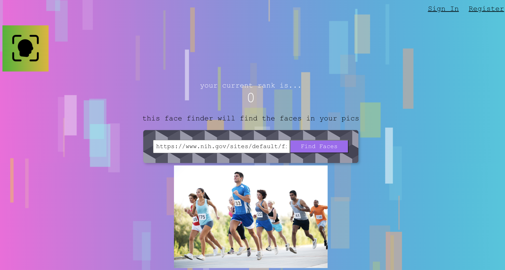

# 🧑‍🤝‍🧑 Face Finder - Front End 🧑‍🤝‍🧑

Face Finder is a unique application that identifies all the faces present in an image. Register for an account, sign in, provide an image URL and let the magic happen!

It isn't currently live (I didn't want to pay for storage), but if someone wants me to spin it up again, let me know!

## 🔍 Features 🔍

- **User Registration and Sign-In**: Securely register and log in to your account.
- **Face Detection**: Provide an image URL and the application will detect and highlight all faces present.

## 🛠️ Built With 🛠️

- [React](https://reactjs.org/)
- Connects with the [Face Finder Backend](https://github.com/jkracz/face-finder-api)
